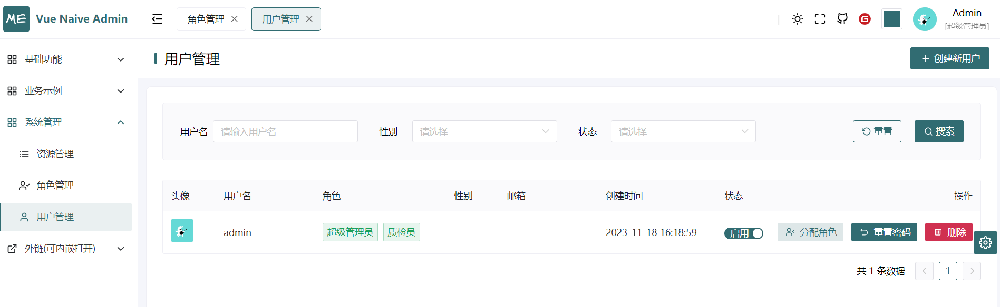
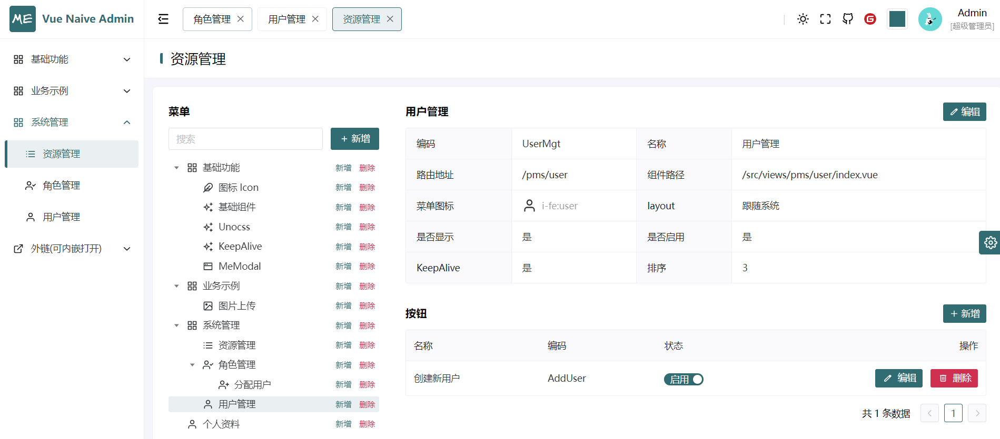

# Springboot 3 + JDK21

## 简介

本项目完全开源，采用MIT协议，无任何带有品牌标识的署名，无条件用于商业用途。
系统从零开始搭建，层次结构严谨，注释齐全，避免过度封装，代码可读性度高。
依赖最简化，减少三方库的引入，从而降低三方库出现漏洞风险，同时降低学习成本，提高了扩展性。

## 功能

1. 账号管理 
2. 权限管理 
3. API鉴权
4. 消息国际化

## 项目预览

<table>
    <tr>
        <td></td>
        <td></td>
    </tr>
</table>

## 前端代码

Gitee:
https://gitee.com/isme-admin/vue-naive-admin/tree/2.x

Github:
https://github.com/zclzone/vue-naive-admin/tree/2.x

## 项目依赖库

* JDK版本: JDK21
* SpringBoot版本： SpringBoot3
* 缓存：Redis、Caffeine
* 权限：SpringSecurity、jjwt
* Json序列化：Jackson
* 数据库：Mybatis、HikariCP
* 实体转换：Mapstruct

## 目录结构划分

```lua
project-parent                -- maven.pom >> 管理所有依赖的版本
│  ├─base23-common-parent     -- maven.pom >> 所用项目都可复用的公共代码
│  │  ├─we-cache-starter      -- 缓存
│  │  ├─we-commons            -- 一些自定义的工具类/杂项
│  │  ├─we-database-starter   -- 数据库
│  │  ├─we-web-starter        -- web服务相关
│  ├─base23-service-parent    -- maven.pom >> 业务代码
│  │  ├─isme-application      -- maven.pom >> isme项目 web微服务
│  │  │  ├─i18n               -- 消息国际化模块
│  │  │  ├─uaa                -- 用户、认证、鉴权模块
│  │  │  │  │-authentication  -- 认证
│  │  │  │  │-authorization   -- 鉴权
│  │  │  │  │-business        -- user/role/permission
│  │  │  │  │-core            -- uaa的公共代码，无业务逻辑
│  │  ├─resources             -- >> 配置文件目录
│  │  │  ├─db                 -- 数据库相关配置
│  │  │  │  │-changelog       -- liqubase配置，管理数据库表的创建、修改
│  │  │  ├─i18n               -- 国际化翻译文件
│  │  │  ├─mapper             -- mybatis代码
```

## 运行项目
直接运行：[IsmeApplication.java](base23-service-parent%2Fisme-application%2Fsrc%2Fmain%2Fjava%2Forg%2Fbase23%2FIsmeApplication.java)

登录账号密码：admin/123456

默认使用h2数据库和caffeine缓存，liqubase框架会自动创建表和插入初始化数据。

切换数据库到mysql：修改application.yml配置：spring.profiles.active=mysql

切换缓存到Redis：修改application.yml配置：spring.cache.type=redis